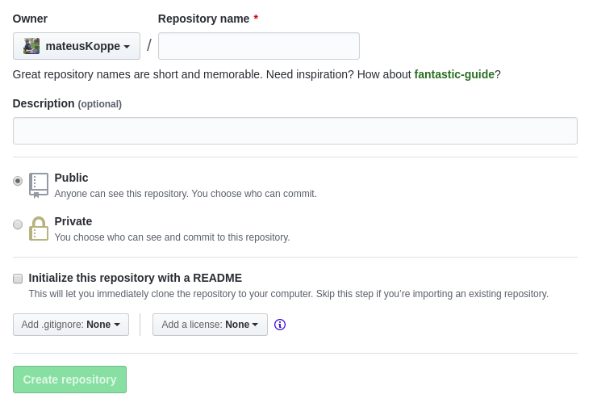
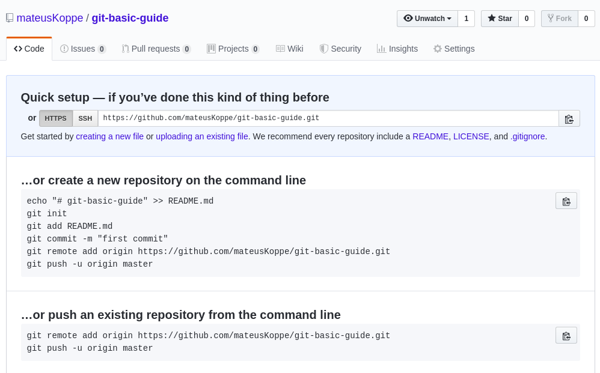

# Por que aprender git?
- Ferramenta de controle de versão
- Ótimo para trabalhar em equipe
- Uma ótima forma de backup
- Mantém o histórico de tudo
- Muito melhor que salvar código em GDrive ou Dropbox
- É de longe a ferramenta mais adotada para versionamento no meio open-source
- Para ser o/a top da balada

# Um pouco de história


Foi criado em 2005 por Linus Torvalds para o versionamento do kernel Linux após desentendimento com a empresa responsável pelo DVCS. Foi rapidamente adotado por outros projetos.

# Sobre a apresentação

## Slides
[github.com/mateusKoppe/git-guia-basico](https://github.com/mateusKoppe/git-guia-basico)

## Links (muito) úteis
- [git-scm.com/book/pt-br/v1](https://git-scm.com/book/pt-br/v1)
- [github.github.com/training-kit/downloads/pt_BR/github-git-cheat-sheet.pdf](https://github.github.com/training-kit/downloads/pt_BR/github-git-cheat-sheet.pdf)
- [github.github.com/training-kit/downloads/pt_BR/github-git-cheat-sheet/](https://github.github.com/training-kit/downloads/pt_BR/github-git-cheat-sheet/)

# Um pouco sobre bash
```bash
pwd # Exibe o diretório atual
ls # Lista os arquivos e pastas no diretório
mkdir <pasta> # Cria um diretório
cd <pasta> # Entra no diretório informado
mv <atual> <novo> # Renomeia um arquivo ou diretório
```

# Como instalar

## Linux
```
sudo apt install git # Debian based
```

## Mac
```
brew install git
```

## Windows
Baixe o executável no site oficial e instale

# Criando um repositório
Repositório é o local onde você armazenará e versionará o seu código.

Navegue até o diretório do seu projeto e digite:
```bash
# Inicia um repositório vazio
git init
```
Quando você executar esse comando uma pasta `.git` será criada no diretório e essa pasta conterá todos os meta dados para gerenciar o seu repositório.

# Um pouco do conceito
O git funciona com base em snapshots, que armazenam as modificações que foram feitas ao longo do projeto.

Essas snapshots agem como "fotografias" que salvam o estado do projeto naquele momento, e então irão aplicar essas mudanças em um commit.


# Setup
Antes de começarmos é necessário configurar algumas informações no git, como por exemplo o nome e o e-mail do usuário já que esses dados que estarão atrelados ao commit.
```bash
git config --global user.name <name>
git config --global user.email <email>
```

## Sobre --global
Utilize apenas no seu computador pessoal, caso você queria definir a configuração apenas para um repositório específico use `--local` (já é o padrão)

# Precisando de ajuda?
```bash
git help # Lista comandos possíveis
git help [comando] # Exibe informações sobre o comando
```

# Comandos e conceitos básicos
O básico para "se virar".

* `git status`
* `git add`
* `git commit`
* `git reset`
* `git diff`

# git status
`git status` é o comando que você utilizará sempre que quiser informações sobre as modificações no repositório.
```bash
# Recebe status do repositório, dos arquivos
git status
```
Os arquivos no seu repositório estarão em um dos dois estados: untracket (não monitorado) ou tracked (monitorado).

# git status

## Tracked (monitorado)
Arquivos em tracked são os arquivos que já estavam na seu último commit, ou seja, o repositório já sabe da existência desse arquivo.

O arquivo pode estar em um dos seguintes estados: unmodified (não modificado), modified (modificado), ou staged (selecionado).

## Untracked (não monitorado)
São os arquivos que ainda não fazem parte do histório do repositório ou ainda não foram selecionados.

# Dicas
Você pode passar a flag `-s` para ver uma versão curta e mais amigável do status.
```
git status -s
```

# git add
Quando você quiser adicionar/monitorar um arquivo para ser commitado você deve utilizar o comando `git add`, esse comando alterará o status do arquivo para staged.

(vai deixar o arquivo verdinho na lista)

```bash
# Adiciona arquivos para serem trackeados
git add <arquivo ou pasta>
```

# Dica
Caso esteja com preguiça de digitar manualmente todos os arquivos que foram modificados você pode simplesmente adicionar o diretório inteiro utilizando `.`, mas tome cuidado para não adicionar arquivo indesejáveis.

```bash
git add .
```

# git reset
> Adicionei um arquivo in staged sem querer, e agora?
Você pode usar `git reset` para retornar um arquivo para o seu status original.

Git status por padrão não irá fazer você perde código.

Outras funcionalidades do `git reset` serão listadas futuramente.

```bash
git reset <arquivo>
```

# git commit
Tudo pronto? Chegou a hora de salvar as mudanças em um commit com uma mensagem dizendo o que esse commit faz, para isso use o comando `git commit`.

O commit é justamente o que da essa ideia de snapshots, será com commits que você ira salvar determinados momentos do seu código e irá "encapsular" as mudanças selecionadas.

```bash
# Cria um commit abrindo-o em um editor
git commit

# De forma rápida:
git commit -m "<message>"
```

# git log
> E para ver isso aí??

Utilize git log para ver quais são os logs de commits do seu repositório.
```bash
# Exibe os logs
git log

# Uma linha por log
git log --oneline
```

# Dica
Você pode usar a flag `--oneline` para visualizar os commits em apenas uma linhas e `--graph` para visualizar o histório de commit em forma de gráfico.
```bash
git log --oneline
git log --graph
git log --oneline --graph # Why not both?
```

# Remote
Git não faria sentido se não houvesse uma forma de compartilhar o repositório com outras pessoas.

Neste momento iremos aprender sobre repositórios remotos e os seguinte comandos:

* `git remote`
* `git push`
* `git pull`
* `git clone`

# Repositório remoto
Um repositório remoto é o local que irá centralizar as informações do seu repositório e poderá ser utilizado em conjunto com mais desenvolvedores.

Existem vários serviços que nos dão acesso a repositórios remotos, os mais populares são:

* [BitBucket](https://bitbucket.com)
* [GitHub](https://github.com)
* [GitLab](https://gitlab.com)

Nesta lição utilizaremos o Github pois ele é nele que estão a maior parte dos projetos open-source.

# Repositório remoto

Repositório remotos também nos dão acesso a algumas funcionalidades que não teríamos em outros cenários, essas funcionalidades variam de serviço em serviço e são armazenadas somente no repositório remoto do serviço.

A maioria dessas funcionalidades torno de gestão de projeto e colaboração e não possuem um padrão ou alguma ligação direta com o projeto git.

Alguns exemplos de funcionalidades:

- Pull Requests
- Code Reviews
- Forks
- Wikis
- Issues
- Entre outros

# Repositório remoto

A maioria dos projetos open-source utilizam dessas ferramentas para manter o projeto organizado e facilitar na contribuição de pessoas que desejam ajudar.

Obs: Agora você não tem mais desculpas para confundir Git com Github ;)

# Criando um repositório no Github


# Criando um repositório no Github


# git remote
Depois de criado o repositório remoto precisamos informar ao nosso repositório local qual é a url que iremos utilizar.

```bash
# Lista os repositórios adicionados
git remote -v

# Adiciona um repositório remoto
git remote add <nome> <url>

# Por convenção o repositório principal geralmente
# é nomeado como origin
git remote add origin <url>
```

# git push
Agora que está o remote configurado é só mandar os seus commits para o repositório remoto.

Para isso utiliza `git push`.
```bash
# Push = Empurra
# Envia os commits da branch selecionada
# para o remote selecionado
git push <remote> <branch>

# O mais comum é
git push origin master
```

# git pull
> E se o repositório remoto tiver commits que eu ainda não tenho?

Nesse caso é utilizado git pull:

```bash
# Pull = Puxa
# Atualiza a branch selecionada de acordo com o
# remote selecionado
git pull <remote> <branch>
```
Uma boa prática é antes de começar a desenvolver sempre rodar um `git pull` para ter certeza que o seu código está atualizado com o repositório remoto.

# git clone
Se quando tudo estiver pronto você quiser utilizar esse repositório em outro computador.

```bash
# Clona um repositório online
git clone <url> [<pasta destino>]
```

Você vai utilizar `git clone` quando for testar o repositório do seu amigo ou qualquer outro que você viu no Github ;)

# Branchs
Branchs são bifurcações no seu códigos, você pode utilizar branchs para isolar o código e trabalhar em um "local" diferente da master até que o seu código esteja pronto, e assim que tudo estiver ok você pode enviar os commits para a master, garantindo assim que a master sempre estará estável.

Além disso é uma forma excelente de trabalhar em equipe, assim cada membro trabalha na sua branch até que a funcionalidade da branch estiver concluída.

* `git branch`
* `git checkout`
* `git stash`
* `git merge`
* `git fetch`
* `git stash`

# git branch
`git branch` é o comando que você usará para visualizar e criar branchs.
```bash
# Lista as branchs criadas e exibe a brach atual
git branch

# Cria uma nova branch baseada na branch atual
git branch <nome da branch>

# Remove uma branch
git branch -d <nome da branch>
```

# git checkout
Assim que você criar a sua branch está tudo pronto para você trocar para a nova branch, para isso utilize o comando `git checkout`.

```bash
# Troca de branch
git checkout <nome da branch>

# Cria e troca de branch
git checkout -b <nome da branch>
``` 

# git merge
Quando você quiser "juntar" branchs você deve utilizar `git merge`, esse comando vai basicamente puxar os commits da branch selecionada na branch atual.

```bash
# Junta os commits da branch atual com a branch alvo
git merge <nome da brach>
```

# Dica
É uma boa prática sempre que for fazer algo um pouco mais trabalhoso criar uma branch e trabalhar nela, assim você pode trabalhar em um ambiente isolado, sem medo de fazer commits e cometer erros, assim que tudo estiver pronto basta fazer o merge :D

# git fetch
Quando você quiser buscar as branchs de algum remote utilize git fetch:
```
git fetch <remote>
```
As branchs desse remote serão criadas com o nome de <remote>/<branch>, para listar essas branchs digite:
```
git branch -a
```

# git stash
```bash
# Salva as mudanças de uma branch e reseta-a
git stash

# Retorna as mudanças que foram salvas para a branch
git stash apply
```

# Comandos úteis
Da para se virar sem mas é sempre bom saber

# git diff
Exibe as diferenças de acordo com o último commit

```bash
git diff

# Exibe as que foram adicionadas:
git diff --cached
```

# git show
Mostra as modificações feitas em determinado commit

```bash
git show <hash do commit>
```

# git reset --hard
Caso você queira voltar, tanto o código quanto o histórico para um commit antigo utilize `git reset --hard`

CUIDADO: Quando você faz isso você perde os commits e todo o códigos que estava nele.

```bash
git reset --hard <hash do commit>
```

# git config credential
Toda vez que você executar um comando remoto que precisa de suas credenciais você precisará informar o seu login e sua senha.

Caso você esteja de saco cheio disso você pode configurar o git para salvar suas credenciais, para isso execute: 
```bash
git config --global credential.helper store
```
CUIDADO: Quando você faz isso você salva sua senha desencriptada no disco, protegida somente pelas permissões do sistema. Se você estiver em uma máquina pública isto não é interessante.

# Gitignore
Caso seja necessário que o repositório ignore algum arquivo ou algumas pasta é possível criar um `.gitignore`, nele você insere quais arquivos deverão ser ignorados no repositório.

# Variável HEAD
Reflete o branch e commit atual.
Você também pode utilizar `~<n>` para referenciar um número de commits anteriores.

```
git push origin HEAD
```
